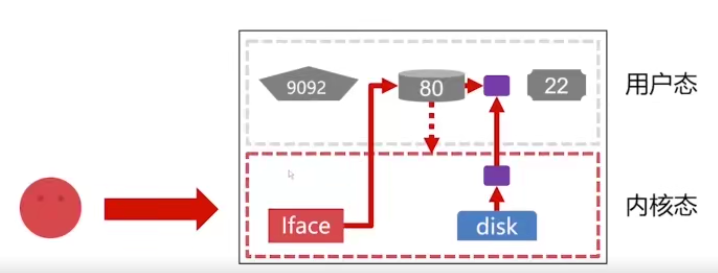
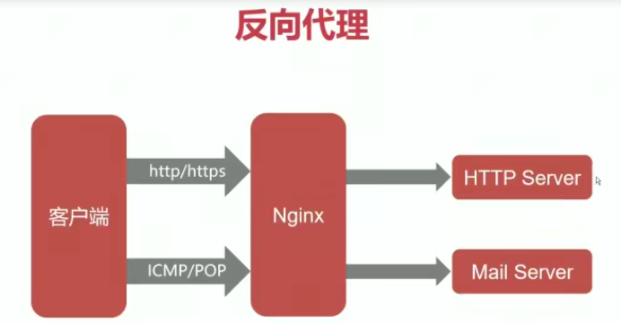

# Nginx

前端工程师->部署前端项目，反向代理nodejs

后端工程师->反向代理java、python等，负载均衡

运维工程师->协调前后端，故障排查，性能优化

## 成体系、内容系统完整

基础配置、进程结构、热升级->核心模块用法->生产场景实践->性能优化

理论讲解->配置示例->适用场景说明

企业使用场景:

动静分离(前端和后端拆分:让后端更专注业务逻辑，提升并发能力)->

Web Server(快速搭建开发测试环境，将代码部署到Nginx上)->

反向代理(对java、python等应用进行反向代理)->

七层负载均衡(横向扩充服务器，增加应用服务的并发能力，对多台应用负载均衡)->

缓存服务器(缓存静态资源和上游应用服务的动态数据，大幅度提升系统并发性能)

高可用>四层反向代理

技术储备要求:Linux基本命令、HTTP基础

### Nginx概述

历史背景、应用场景、主要特点、部署使用

### 基础使用

进程结构、热部署、模块分类、基础语法

### 进阶使用

core模块、log模块、rewrite模块、ssl模块...

### 场景实践

反向代理、负载均衡、https、限速、动静分离

### 软件架构

同步异步、阻塞非阻塞、多路I0复用、连接池

### 性能优化

TCP协议栈优化、磁盘IO优化、模块优化、内存分配优化

#### 概念

Nginx(engine x)是一个高性能的`HTTP和反向代理`web服务器，同时也提供了IMAP/IPOP3/SMTP服务,源代码以类BSD许可证的形式发布，因它的稳定性、丰富的功能集、示例配置文件和低系统资源的消耗而间名
Nginx是一款轻量级的Web服务器/反向代理服务器及电子邮件（IMAP/POP3）代理服务器，在BSD-like协议下发行。其特点是占有内存少，并发能力强,中国大陆使用nginx网站用户有：百度、京东、新浪、网易、腾讯、淘宝等。

`高性能的静态WEB服务器`+`反向代理`

2-3
