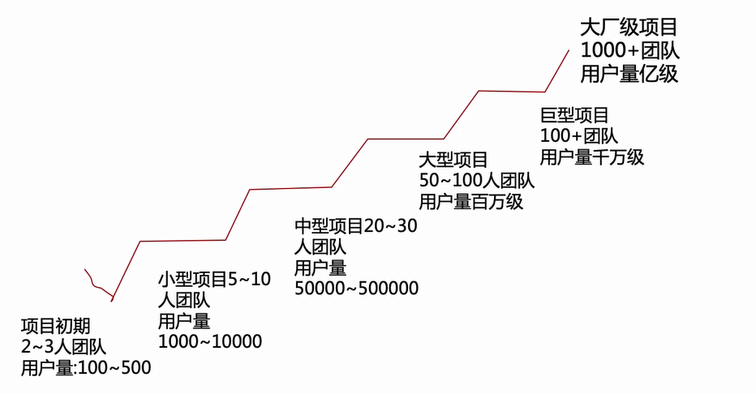
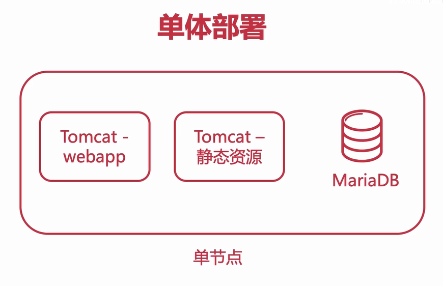
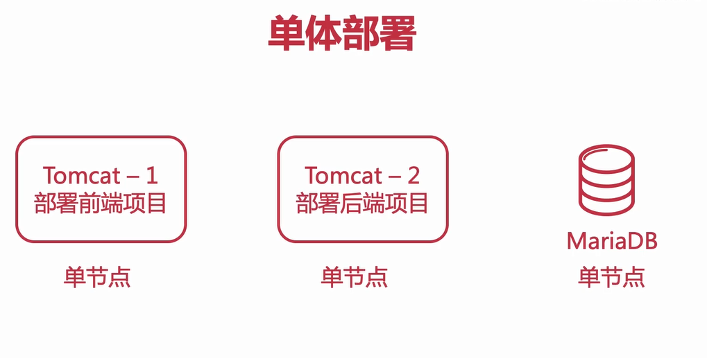
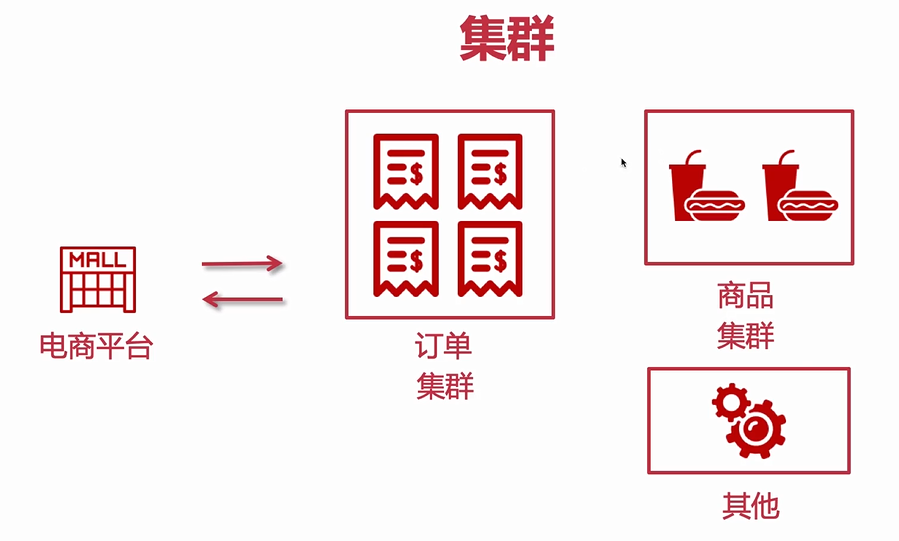

# Java架构师

### 本阶段规划

从单体到集群过渡、
Nginx入门、
Nginx实现集群与负载均衡、
高可用Nginx方案与实现、
生产环境Nginx替换Tomcat、


单体架构的优点

```node
◆小团队成型即可完成开发-测试-上线
◆迭代周期短，速度快
◆打包方便（war包），运维省事
```

单体架构面临的挑战

```node
◆单节点宕机造成所有服务不可用--集群
◆耦合度太高（迭代，测试，部署）--微服务和分布式拆分
◆单节点并发能力有限--负载均衡
```

集群概念

```node
◆计算机‘群体’构成整个系统
◆这个‘群体’构成一个整体，不能独立存在
◆‘人多力量大’，群体提升并发与可用性
```


使用集群的优势

```node
◆提高系统性能
◆提高系统可用性
◆可扩展性高
```

使用集群的注意点

```node
◆用户会话（redis缓存实现分布式会话）
◆定时任务
◆内网互通
```

什么是`Nginx`Nginx(engine x)是一个`高性能的HTTP和反向代理web服务器`，同时也提供IMAP/POP3/SMTP服务,通过配置文件可以`实现集群和负载均衡`,`静态资源虚拟化`
